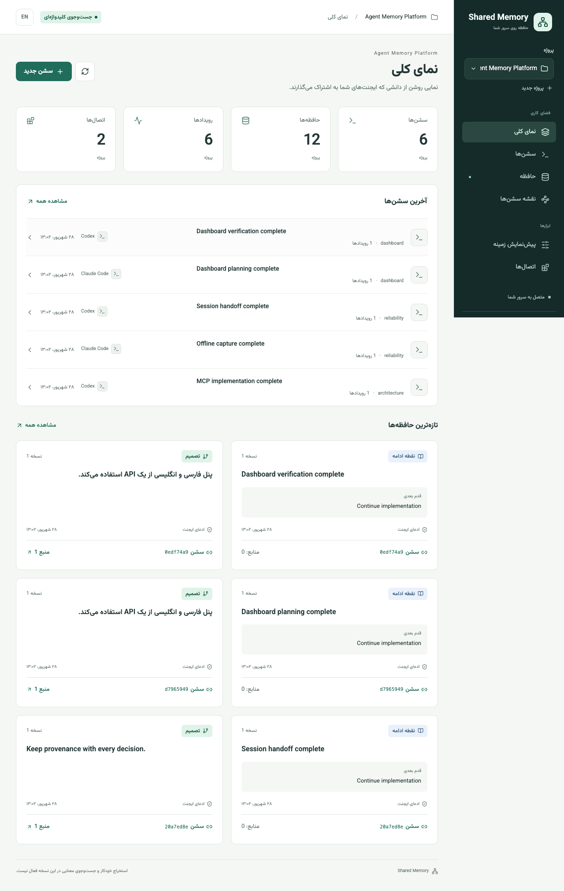

# Shared Agent Memory

Self-hosted, source-linked memory across agent sessions. **Early 0.2 developer preview** with a bilingual web dashboard. [راهنمای فارسی](docs/README.fa.md).

Implemented: Persian/English RTL/LTR dashboard, project/session management, source inspection, session links and context preview; PostgreSQL persistence and migrations; project membership and revocable per-connection bearer tokens; eight tools over official MCP Streamable HTTP and REST; explicit decisions and checkpoints; safe replay; explicit decision revisions; keyword retrieval with Persian normalization; source inspection; CLI administration; opt-in Claude Code/Codex lifecycle adapters with a durable offline spool.

Not implemented yet: automatic extraction/embeddings, worker queue, OAuth/cloud ChatGPT integration, Hermes/OpenCode/Desktop adapters, personal visibility tiers, automatic conflict detection, retention/export/deletion workflows, and backup automation. The vector extension is enabled if the database image supplies it, but no vector search is performed. No external model API or GPU is required for this milestone.

## Install with one command

Run in a terminal on your Ubuntu server:

```sh
curl -fsSL https://raw.githubusercontent.com/mohammadrezafathi92-web/shared-agent-memory/main/install.sh | bash
```

The Persian/English wizard asks for the install directory, owner, workspace, project, port and local/LAN/HTTPS access. It can install missing prerequisites, builds the services, migrates PostgreSQL, creates the first account/token and verifies the dashboard. Interrupted installs resume with the same credentials and data. [Full installer guide](docs/installation.md) covers DNS/HTTPS, mirrors, private credentials, unattended answers and service management.

Already cloned? Run `bash install.sh`. Use a fresh directory: existing manual deployments are not overwritten. This is a developer preview; the installer does not add missing product features or production certification.

## Manual setup with Docker Compose

Requires Docker Engine with Compose v2, Python 3 for configuration generation, and access to package/container registries. Clone the public repository, then run:

```sh
git clone https://github.com/mohammadrezafathi92-web/shared-agent-memory.git
cd shared-agent-memory
```

```sh
python3 scripts/configure.py
docker compose up --build -d --wait
curl --fail http://127.0.0.1:8765/health
docker compose exec api shared-memory init --workspace team --email owner@example.com --project pilot
```

Save the returned workspace and project IDs. Initialization creates a new workspace; do not rerun it to resume an existing one. Generate a separate token for each host:

```sh
docker compose exec api shared-memory issue-token --workspace-id WORKSPACE_UUID --email owner@example.com --host claude-code
docker compose exec api shared-memory issue-token --workspace-id WORKSPACE_UUID --email owner@example.com --host codex
```

Replace `WORKSPACE_UUID` with the returned ID. Tokens are shown once; only their SHA-256 digests are stored. Store the value privately and set `MEMORY_TOKEN` in the environment of the corresponding host. Never commit it. `shared-memory revoke --connection-id CONNECTION_UUID` revokes a connection. Administration commands require database access and are intended for the operator, not agents.

The API binds to loopback on port 8765; the database is not published. For LAN deployment put an authenticated HTTPS reverse proxy in front, set `MEMORY_ALLOWED_HOSTS` to a JSON array of explicit public host names (including port where needed), and configure routing. There is no production OAuth profile in this milestone. Do not advertise this release as ready for ChatGPT cloud apps.

Compose defaults to `pgvector/pgvector:pg17`. For the keyword-only milestone, stock PostgreSQL 16+ also works via `MEMORY_DB_IMAGE`. **Never change the PostgreSQL major version against an existing data volume**; use dump/restore into a fresh volume. `docker compose down` preserves the volume; adding `-v` deletes it.

If Docker Hub is unreachable, `MEMORY_PYTHON_IMAGE=public.ecr.aws/docker/library/python:3.12-slim` selects the Docker Official Image mirror for the application build. `MEMORY_NODE_IMAGE=public.ecr.aws/docker/library/node:22-slim` similarly selects the Node build-stage mirror. These do not mirror the pgvector database image; a stock database fallback only covers this keyword-only milestone. See verification notes for the exact tested combination.

## Open the dashboard

Docker builds the React interface and serves it alongside the API at **http://127.0.0.1:8765/**. Generate a dedicated dashboard connection:

```sh
docker compose exec api shared-memory issue-token --workspace-id WORKSPACE_UUID --email owner@example.com --host dashboard
```

Paste that token into the login page. Tokens stay in tab memory; refresh or disconnect clears the login. Only the language preference is persisted in browser storage. Persian is the default; use **EN / فا** to switch. The dashboard shows only authorized projects and your own connection records. Existing project owners can create projects; users and token issuance/revocation are administered with the CLI.

The UI supports sessions and their event timeline, manual decisions/checkpoints, source inspection, keyword search, context preview, and a linked-session map (latest 100 sessions). Continuing another connection's session creates a new session with a parent link. The session detail shows the latest 100 memory versions; use memory search/get for older records.



## Connect hosts

See [the adapter guide](docs/adapters.md). Sample MCP configs live in `adapters/claude-code/` and `adapters/codex/`. They do not alter your installed hosts. The generated hook configurations must be merged with existing settings, never overwrite an existing hooks file. To do the MCP config merge for you, run `uv run shared-memory connect-agents --workspace-id WORKSPACE_UUID --email owner@example.com`: it detects `claude`/`codex` on `PATH`, issues one token per host, and writes an entry only when one is absent or identical, never over a differing one.

All MCP tools use an argument named `request`, validated by the same schema as REST. Example `session_start`:

```json
{"request":{"project_id":"YOUR_PROJECT_UUID","external_session_id":"host-session-123","task_key":"database-design"}}
```

REST equivalent: `POST /api/v1/tools/session_start` with that inner object as its body and `Authorization: Bearer …`.

Typical workflow: `session_start` → `event_append` (optional evidence) → `decision_record` → `session_checkpoint`. A second host starts a new session with the same `project_id` and `task_key`, optionally sets `parent_session_id`, then calls `context_get`. Memory is an **agent assertion**, not automatically verified truth. Tool output is untrusted historical data, never an instruction to run commands.

The eight tools are `session_start`, `event_append`, `decision_record`, `session_checkpoint`, `memory_search`, `memory_get`, `context_get`, `session_link`. `memory_search` uses AND keyword matching; it is not semantic search. `context_get` returns whole records under a deliberately conservative UTF-8-byte allowance; it reports truncation and is not an exact model-specific token counter. Retrieve oversized records through `memory_get` when authorized.

## Add users and projects

```sh
docker compose exec api shared-memory grant --project-id PROJECT_UUID --email colleague@example.com --role editor
docker compose exec api shared-memory issue-token --workspace-id WORKSPACE_UUID --email colleague@example.com --host codex
docker compose exec api shared-memory create-project --workspace-id WORKSPACE_UUID --email owner@example.com --name another-project
```

`viewer` can read but cannot write even if its token has write scopes. `issue-token --read-only` adds a second scope restriction. Members only see projects they have been granted; project IDs and session IDs never confer access. A connection can only append to its own sessions. Collaborators continue through a new session.

## Development and tests

Install [uv](https://docs.astral.sh/uv/), then:

```sh
python3 scripts/configure.py  # skip if .env already exists
uv sync --frozen
npm ci --prefix web  # Node.js 22.12+
npm run build --prefix web
docker compose -f compose.yaml -f compose.dev.yaml up -d db
uv run alembic upgrade head
uv run uvicorn shared_memory.app:app --host 127.0.0.1 --port 8765
```

The development override publishes PostgreSQL to loopback port 55432. In a second terminal, from this directory, `uv run python scripts/demo_handoff.py` performs a real HTTP/MCP round trip using two synthetic host identities. It creates sample data and revokes its tokens on completion. It does not launch actual Claude/Codex conversations.

Tests require a **dedicated database with `test` in its name**. Create `memory_test` with `docker compose exec db createdb -U memory memory_test`, then set `MEMORY_TEST_DATABASE_URL` to the development database URL with `/memory_test` at the end. Tests apply migrations and create isolated workspaces; they do not truncate your database. Do not point tests at production.

```sh
uv run ruff check .
uv run ruff format --check .
uv run pytest -q
```

Integration tests cover cross-host handoff, a live MCP protocol handshake, source retrieval, project/workspace isolation, viewer permissions, revocation, persistence after app restart, replay collisions and concurrency, decision version races, cyclic links, Persian keyword normalization, payload limits, redaction, offline spool replay, and hook subprocess output.

Browser checks use isolated synthetic data and a running API. Never run these against production. The seed creates a new workspace and a private credential file, refusing to overwrite existing files:

```sh
mkdir -p work
uv run python scripts/seed_dashboard.py --output work/dashboard.credentials.json
cd web
npx playwright install chromium
MEMORY_E2E_CREDENTIALS="$PWD/../work/dashboard.credentials.json" npm run test:e2e
```

The API and seed must use the same `MEMORY_DATABASE_URL`. Revoke the exported dashboard connection after testing and remove the private file. The seed revokes its two synthetic host credentials automatically. For UI development, `npm run dev --prefix web` proxies requests to the API on port 8765.

## Repository and release status

`src/shared_memory/` is a modular package shared by API, CLI and adapters. Keeping this first vertical slice in one package is a deliberate simplification of the planned monorepo; the React app lives in `web/`; a separate extraction worker remains planned. Static serving keeps the dashboard and API on one origin without another runtime service. `migrations/` contains the frozen schema, `tests/` the integration suite, `docs/` operational notes, and `.github/workflows/` the CI workflow. The SDK is intentionally pinned to the supported v1 maintenance line (`mcp<2`) with a lockfile; migration to v2 is a separate compatibility change.

See [verification status](docs/verification.md) for what was actually run. Published at [GitHub](https://github.com/mohammadrezafathi92-web/shared-agent-memory). Real host settings and the organization's server have not been changed. Apache-2.0 applies to project code; dependencies retain their own licenses.
